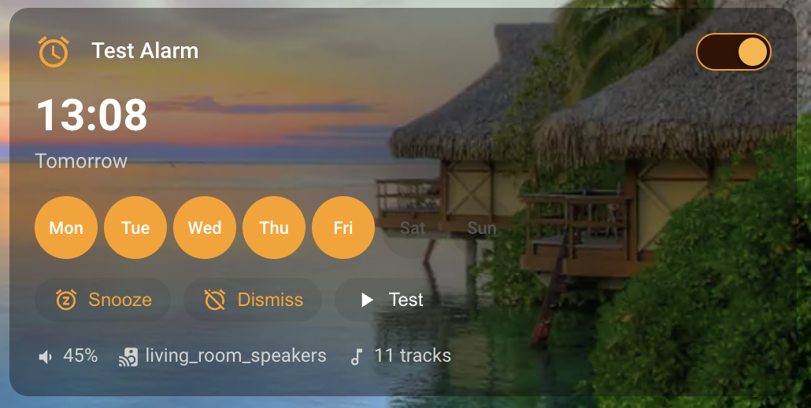

# Chromecast Alarm Card

A Mushroom-style Lovelace dashboard card for the [Chromecast Alarm](https://github.com/padlefot/ha_chromecast_alarm) Home Assistant integration.



## Features

- Enable/disable toggle
- Next fire time with relative date (Today / Tomorrow / day name)
- Active days display with configurable chip size
- Snooze, Dismiss, and Test buttons
- Alarm firing animation with stop button
- Details row: volume, target speaker, holiday skip, track count
- Interactive: set time, toggle days, adjust volume, change speaker — all from the card
- Configurable via visual editor (time size, day size, show/hide details)
- Dark and light mode support

## Installation

### HACS

1. In HACS, go to Frontend
2. Click the three dots menu and select Custom repositories
3. Add `https://github.com/padlefot/ha_chromecast_alarm_card` with category **Dashboard**
4. Search for "Chromecast Alarm Card" and install
5. Refresh your browser

### Manual

1. Download `chromecast-alarm-card.js` from the latest release
2. Copy to `config/www/chromecast-alarm-card.js`
3. Add as a dashboard resource: `/local/chromecast-alarm-card.js` (type: module)

## Usage

```yaml
type: custom:chromecast-alarm-card
entity: switch.morning_alarm
```

### Options

| Option | Default | Description |
|---|---|---|
| `entity` | *required* | Switch entity from Chromecast Alarm integration |
| `time_size` | `28px` | Next fire time font size (22px / 28px / 36px / 44px) |
| `day_size` | `32px` | Day chip diameter (26px / 32px / 40px) |
| `show_details` | `true` | Show volume, speaker, holidays row |

## Requirements

- [Chromecast Alarm](https://github.com/padlefot/ha_chromecast_alarm) integration v0.3.4+ (for volume/speaker control)
